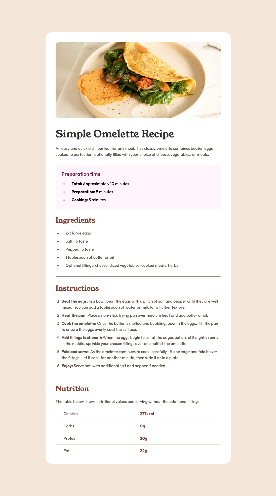

# Frontend Mentor - Recipe page solution

This is a solution to the [Recipe page challenge on Frontend Mentor](https://www.frontendmentor.io/challenges/recipe-page-KiTsR8QQKm). Frontend Mentor challenges help you improve your coding skills by building realistic projects.  

## Table of contents

- [Overview](#overview)
  - [Screenshot](#screenshot)
  - [Links](#links)
- [My process](#my-process)
  - [Built with](#built-with)
  - [What I learned](#what-i-learned)
  - [Continued development](#continued-development)
  - [Useful resources](#useful-resources)
- [Author](#author)
- [Acknowledgments](#acknowledgments)

## Overview

### Screenshot

### Links

- Solution URL: [GitHub](https://github.com/hartashu/recipe-page)
- Live Site URL: [GitHub Pages](https://hartashu.github.io/recipe-page/)

## My process

### Built with

- Semantic HTML5 markup
- CSS custom properties
- Flexbox
- Grid

### What I learned

- Learn about centering a container horizontally and vertically by using flex box or position absolute
- Learn about:
  - CSS variable
  - CSS unit
  - Transform property
  - Position property
  - pseudo-classes and pseudo-elements
  - ul, ol, li, table elements
  - and other HTML & CSS skills.

### Continued development

Keep learning and improving in every aspect.

### Useful resources

- [HTML & CSS Course by SuperSimpleDev](https://youtu.be/G3e-cpL7ofc?si=4xxA1hw_5mU_9-aX) - Recommended for getting started with HTML & CSS from zero.
- [Git & GitHub Tutorial by SuperSimpleDev](https://youtu.be/hrTQipWp6co?si=HIO_1gWZHOGBGxDH) - Helped me understanding about work with Git and GitHub.
- [Learn CSS Units](https://youtu.be/-GR52czEd-0?si=qHL5x0IH4GpsBNtq) - Easy to understand about CSS units.
- [Learn CSS Transform](https://youtu.be/rzD-cPhq02E?si=MpCFcO-d6k9C4QKo) - Simply explained about CSS transform.
- [The Gap After The List Marker](https://css-tricks.com/everything-you-need-to-know-about-the-gap-after-the-list-marker/) - Explain about list marker gap.
- [Styling HTML Table with CSS](https://youtu.be/biI9OFH6Nmg?si=XzuXiAL7lfvz0CFr)

## Author

- GitHub - [hartashu](https://github.com/hartashu)
- Frontend Mentor - [@hartashu](https://www.frontendmentor.io/profile/hartashu)

## Acknowledgments

Thanks to everyone who kindly and heartedly share knowledges all over the internet.